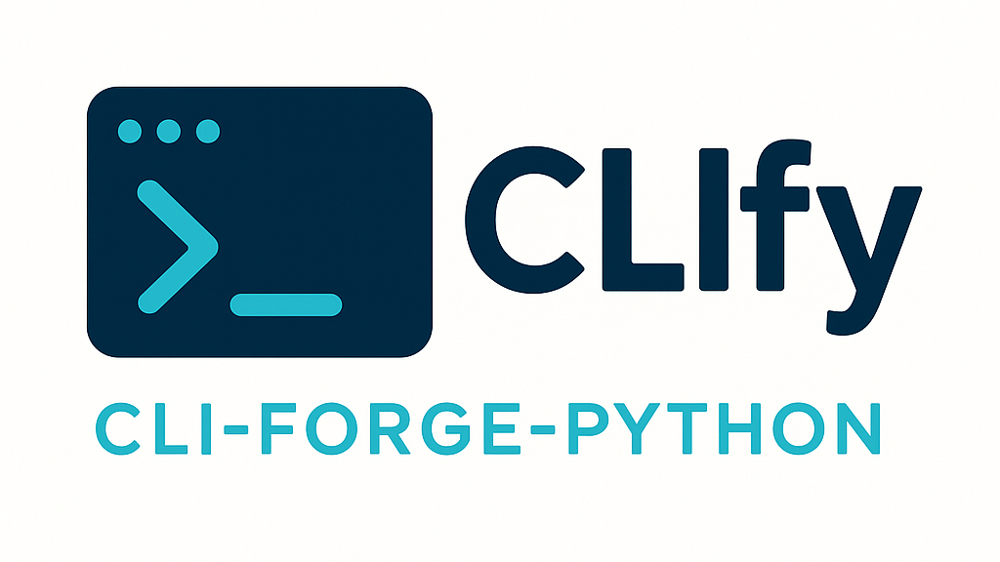

<div align="center">
  
  
  # CLIfy - CLI Forge for Python
  
  ### *Formerly PyArgWriter*
  
  [](https://coveralls.io/github/RobinU434/PyArgWriter?branch=main)
  
  
  
  
  **Transform your Python classes into powerful command-line interfaces automatically**
  
  [Quick Start](#-quick-start) • [Features](#-features) • [Documentation](#-documentation) • [Contributing](#-contributing)
  
</div>

---

## What is CLIfy?

CLIfy (CLI Forge for Python) automatically generates production-ready `ArgumentParser` setups from your Python classes and their methods. No more tedious manual parser configuration—just write your code with proper docstrings, and CLIfy does the rest.

> **Important:** The next major version (v2.0.0) will complete the rebranding from PyArgWriter to CLIfy, including package name changes. Current users should plan for migration.

### Why CLIfy?

- **Zero Boilerplate**: Write your business logic, not argument parsing code
- **Documentation-Driven**: Uses your existing docstrings to generate help messages
- **Type-Safe**: Leverages Python type hints for automatic type conversion
- **Hydra Integration**: Seamlessly combine with Hydra for advanced configuration management
- **Pretty Output**: Optional code formatting with Black
- **Four Docstring Formats**: Supports Google, NumPy, reStructuredText, and Epydoc styles

---

## Quick Start

### Installation

Install CLIfy from PyPI (currently published as `pyargwriter`):

```bash
pip install pyargwriter
```

**Alternative installations:**

From source with pip:
```bash
git clone https://github.com/RobinU434/PyArgWriter.git
cd PyArgWriter
pip install .
```

With Poetry:
```bash
poetry install
```

### Your First CLI in 30 Seconds

1. **Write your Python class with docstrings:**

```python
# myapp.py
class DataProcessor:
    """Process and analyze data files."""
    
    def process(self, input_file: str, output_format: str = "json", verbose: bool = False):
        """Process a data file and convert it to the specified format.
        
        Args:
            input_file (str): Path to the input data file
            output_format (str): Output format (json, csv, xml). Defaults to json.
            verbose (bool): Enable verbose logging
        """
        print(f"Processing {input_file} to {output_format}")
        if verbose:
            print("Verbose mode enabled")
```

2. **Generate the CLI:**

```bash
clify generate-argparser --input myapp.py --output . --pretty
```

or

```bash
python -m pyargwriter generate-argparser --input myapp.py --output . --pretty
```

3. **Use your new CLI:**

```bash
python -m myapp process --input-file data.txt --output-format csv --verbose
```

That's it!

For more detailed instructions, see the either down below or the [Quick Reference](documentation/QUICK_REFERENCE.md).

---

## Features

### Automatic Argument Generation
CLIfy analyzes your code and generates:
- Command-line argument definitions
- Type conversions (int, float, str, bool, lists)
- Default values
- Help messages from docstrings
- Subcommands for class methods

### Supported Types
```python
# Primitive types
def example(
    count: int,              # Integer argument
    ratio: float,            # Float argument  
    name: str,               # String argument
    enabled: bool,           # Boolean flag
):
    pass

# List types (both styles)
def process(
    ids: list[int],          # Python 3.9+ style
    names: List[str],        # typing module style
    values: list[float],
    flags: List[bool],
):
    pass
```

### Multiple Docstring Formats

CLIfy supports four major Python docstring styles:

<details>
<summary><b>Google Style (Default)</b></summary>

```python
def train_model(data: str, epochs: int = 10, learning_rate: float = 0.01):
    """Train a machine learning model.
    
    Args:
        data (str): Path to training data
        epochs (int): Number of training epochs. Defaults to 10.
        learning_rate (float): Learning rate. Defaults to 0.01.
    
    Returns:
        dict: Training results
    """
    pass
```
</details>

<details>
<summary><b>NumPy Style</b></summary>

```python
def train_model(data: str, epochs: int = 10, learning_rate: float = 0.01):
    """
    Train a machine learning model.
    
    Parameters
    ----------
    data : str
        Path to training data
    epochs : int, optional
        Number of training epochs. Defaults to 10.
    learning_rate : float, optional
        Learning rate. Defaults to 0.01.
    
    Returns
    -------
    dict
        Training results
    """
    pass
```
</details>

<details>
<summary><b>reStructuredText (Sphinx)</b></summary>

```python
def train_model(data: str, epochs: int = 10, learning_rate: float = 0.01):
    """
    Train a machine learning model.
    
    :param data: Path to training data
    :type data: str
    :param epochs: Number of training epochs. Defaults to 10.
    :type epochs: int
    :param learning_rate: Learning rate. Defaults to 0.01.
    :type learning_rate: float
    :return: Training results
    :rtype: dict
    """
    pass
```
</details>

<details>
<summary><b>Epydoc Style</b></summary>

```python
def train_model(data: str, epochs: int = 10, learning_rate: float = 0.01):
    """
    Train a machine learning model.
    
    @param data: Path to training data
    @type data: str
    @param epochs: Number of training epochs. Defaults to 10.
    @type epochs: int
    @param learning_rate: Learning rate. Defaults to 0.01.
    @type learning_rate: float
    @return: Training results
    @rtype: dict
    """
    pass
```
</details>

See [DOCSTRING_FORMAT_EXAMPLES.md](documentation/DOCSTRING_FORMAT_EXAMPLES.md) for comprehensive examples.

### Hydra Integration

Combine CLIfy with [Hydra](https://hydra.cc/) for advanced configuration management:

```python
from omegaconf import DictConfig
from pyargwriter.decorator import add_hydra

class MLPipeline:
    """Machine learning training pipeline."""
    
    @add_hydra("config", version_base=None)
    def train(self, config: DictConfig, device: str = "cuda"):
        """Start training process.
        
        Args:
            config (DictConfig): Hydra configuration object
            device (str): Device to train on (cuda/cpu). Defaults to cuda.
        """
        print(f"Training on {device}")
        print(f"Config: {config}")
```

After generating with CLIfy, you can use both ArgumentParser and Hydra features:

```bash
python -m mlpipeline train --device cpu --config-name my_config
```

---

## Usage Guide

### Command-Line Interface

CLIfy provides three main commands accessible via `clify` or `python -m pyargwriter`:

#### 1. `generate-argparser` - One-Stop Solution ⭐

Generate a complete ArgumentParser setup in one command:

```bash
clify generate-argparser \
    --input file1.py file2.py \
    --output ./cli \
    --pretty \
    --log-level INFO
```

**Options:**
- `--input`: Python files to process (multiple files supported)
- `--output`: Output directory for generated code (default: current directory)
- `--pretty` / `-p`: Format generated code with Black
- `--log-level`: Set logging level (DEBUG, INFO, WARN, ERROR)

**Generated files:**
- `__init__.py`: Package initialization
- `__main__.py`: CLI entry point
- `utils/parser.py`: ArgumentParser setup function

#### 2. `parse-code` - Extract Structure

Parse Python files and create a YAML structure:

```bash
clify parse-code \
    --input file1.py file2.py \
    --output structure.yaml \
    --log-level INFO
```

**Output:** YAML file containing parser structure that can be edited before code generation.

#### 3. `write-code` - Generate from YAML

Generate ArgumentParser code from a YAML structure:

```bash
clify write-code \
    --input structure.yaml \
    --output ./cli \
    --pretty \
    --log-level INFO
```

**Workflow:** Useful for customizing the parser structure before generating code.

### Python API

Use CLIfy programmatically in your Python code:

```python
from pyargwriter.entrypoint import ArgParseWriter

# Create writer instance
writer = ArgParseWriter(
    pretty=True,          # Format with Black
    force=True,           # Overwrite existing files
    docstring_format="google"  # Docstring style
)

# Generate ArgumentParser
writer.generate_parser(
    files=["myapp.py", "utils.py"],
    output="./cli"
)

# Or use the two-step process
writer.parse_code(
    files=["myapp.py"],
    output="structure.yaml"
)

writer.write_code(
    structure_file="structure.yaml",
    output="./cli"
)
```

---

## Examples

### Example 1: Simple CLI Tool

```python
# calculator.py
class Calculator:
    """A simple calculator with basic operations."""
    
    def add(self, a: float, b: float):
        """Add two numbers.
        
        Args:
            a (float): First number
            b (float): Second number
        """
        return a + b
    
    def multiply(self, numbers: list[float]):
        """Multiply a list of numbers.
        
        Args:
            numbers (list[float]): Numbers to multiply
        """
        result = 1
        for n in numbers:
            result *= n
        return result
```

**Generate CLI:**
```bash
clify generate-argparser --input calculator.py --output . --pretty
```

**Use CLI:**
```bash
python -m calculator add --a 5 --b 3
python -m calculator multiply --numbers 2 3 4
```

### Example 2: Data Processing Pipeline

```python
# pipeline.py
class DataPipeline:
    """ETL pipeline for data processing."""
    
    def extract(self, source: str, format: str = "csv"):
        """Extract data from source.
        
        Args:
            source (str): Data source path
            format (str): Input format (csv, json, parquet)
        """
        pass
    
    def transform(self, 
                  input_file: str, 
                  operations: list[str],
                  validate: bool = True):
        """Transform data with specified operations.
        
        Args:
            input_file (str): Input data file
            operations (list[str]): List of operations to apply
            validate (bool): Validate data after transformation
        """
        pass
```

**Generate and use:**
```bash
clify generate-argparser --input pipeline.py --output . --pretty
python -m pipeline extract --source data.csv --format csv
python -m pipeline transform --input-file data.csv --operations clean normalize --validate
```

### More Examples

Check out the [examples/](examples/) directory for complete working examples:
- `shopping.py` - E-commerce shopping cart CLI
- `car.py` - Vehicle management system
- `ml_pipeline.py` - Machine learning training pipeline with Hydra

---

## Requirements

### Docstring Requirements

CLIfy relies on well-structured docstrings to generate meaningful CLI help messages. **Minimum required structure:**

```python
def function_name(arg1: type1, arg2: type2) -> return_type:
    """Brief description of the function.
    
    Args:
        arg1 (type1): Description of arg1
        arg2 (type2): Description of arg2
    
    Returns:
        return_type: Description of return value
    """
    pass
```

**Key points:**
- Type hints are required for proper argument parsing
- Docstrings should follow one of the supported formats (Google, NumPy, reST, Epydoc)
- Each argument should be documented in the Args section
- Missing docstrings will result in default help messages

### System Requirements

- **Python**: >= 3.10, < 4.0
- **Dependencies**:
  - `argparse >= 1.4.0`
  - `black >= 23.12.1` (for pretty formatting)
  - `hydra-core >= 1.3.2` (for Hydra integration)
  - `pyaml >= 23.12.0`

---

## Configuration

### Docstring Format Selection

Specify your preferred docstring format when generating:

```bash
# Via CLI (coming in v2.0.0)
clify generate-argparser --input myapp.py --format numpy

# Via Python API
writer = ArgParseWriter(docstring_format="numpy")  # google, numpy, rest, epytext
```

### Code Formatting

Enable Black formatting for clean, PEP 8-compliant output:

```bash
clify generate-argparser --input myapp.py --pretty
```

### Logging Levels

Control verbosity with `--log-level`:

```bash
clify generate-argparser --input myapp.py --log-level DEBUG
```

Options: `DEBUG`, `INFO`, `WARN` (default), `ERROR`


---

## Documentation

### Official Documentation

- **[Complete Documentation](documentation/latex/refman.pdf)** - Full API reference and guides
- **[Documentation Website](https://htmlpreview.github.io/?https://github.com/RobinU434/PyArgWriter/blob/main/documentation/html/index.htm)** - Browse online
- **[Docstring Format Examples](documentation/DOCSTRING_FORMAT_EXAMPLES.md)** - Comprehensive examples of all supported formats
- **[Enhancement Summary](DOCSTRING_PARSER_ENHANCEMENT.md)** - Recent improvements and features

### Quick References

- **Supported Types**: int, float, str, bool, list[int], list[float], list[str], list[bool], List[T]
- **Docstring Formats**: Google, NumPy, reStructuredText, Epydoc
- **Python Version**: >= 3.10, < 4.0
- **Entry Points**: `clify` or `python -m pyargwriter`

---

## Contributing

We welcome contributions from developers of all skill levels! CLIfy is an open-source project that thrives on community involvement.

### Ways to Contribute

#### For Developers

1. **Add New Features**
   - Support for additional docstring formats
   - Enhanced type inference
   - GUI/Web interface for parser generation
   - IDE plugins (VS Code, PyCharm)
   - Integration with other frameworks (Click, Typer)

2. **Improve Code Generation**
   - Better error handling and validation
   - More sophisticated argument parsing patterns
   - Support for nested subcommands
   - Custom validators and converters

3. **Enhance Testing**
   - Increase test coverage (current: [see coverage badge])
   - Add property-based tests with hypothesis
   - Performance benchmarks
   - Integration tests with real-world projects

4. **Documentation**
   - Improve existing docs
   - Create tutorials and guides
   - Add more examples
   - Translate documentation

#### Priority Areas

We're particularly interested in contributions for:

- [ ] **v2.0.0 Migration** - Help with the CLIfy rebranding
- [ ] **Parser Format Support** - Extend beyond ArgumentParser (Click, Typer, etc.)
- [ ] **Type System** - Better support for complex types (dataclasses, Pydantic models)
- [ ] **Code Generator Tests** - Expand test coverage for code_generator.py module
- [ ] **Integration Tests** - End-to-end workflow tests
- [ ] **Documentation** - Video tutorials, blog posts, case studies

### Getting Started with Development

#### 1. Fork and Clone

```bash
git clone https://github.com/RobinU434/PyArgWriter.git
cd PyArgWriter
```

#### 2. Set Up Development Environment

```bash
# Using Poetry (recommended)
poetry install
poetry shell

# Or using pip
pip install -e ".[dev]"
```

#### 3. Run Tests

```bash
# Run all tests
pytest

# Run with coverage
pytest --cov=pyargwriter --cov-report=html

# Run specific test file
pytest test/test_docstring_parser.py -v

# Run with specific markers
pytest -m "not slow"
```

#### 4. Code Quality

```bash
# Format code with Black
black pyargwriter test

# Check formatting
black --check pyargwriter test

# Type checking (if using mypy)
mypy pyargwriter

# Linting (if using pylint/flake8)
pylint pyargwriter
```

#### 5. Make Your Changes

- Create a feature branch: `git checkout -b feature/amazing-feature`
- Write tests for new functionality
- Ensure all tests pass
- Update documentation
- Follow existing code style

#### 6. Submit a Pull Request

- Push to your fork: `git push origin feature/amazing-feature`
- Open a Pull Request with a clear description
- Link related issues
- Wait for review and address feedback

### Contribution Guidelines

#### Code Style

- Follow [PEP 8](https://pep8.org/) guidelines
- Use Black for code formatting (line length: 88)
- Write descriptive docstrings (Google style preferred)
- Include type hints for all functions

#### Commit Messages

Use clear, descriptive commit messages:

```bash
# Good
git commit -m "Add support for Click framework integration"
git commit -m "Fix: Handle missing docstrings gracefully"
git commit -m "Docs: Update installation instructions"

# Bad
git commit -m "fixed stuff"
git commit -m "update"
```

#### Pull Request Template

When opening a PR, please include:

1. **Description**: What changes did you make and why?
2. **Related Issues**: Link to relevant issues (#123)
3. **Testing**: How did you test your changes?
4. **Documentation**: Did you update relevant docs?
5. **Breaking Changes**: Any backwards-incompatible changes?

#### Testing Requirements

- All new features must include tests
- Maintain or improve current test coverage
- Tests should be clear and well-documented
- Include both positive and negative test cases

### Project Structure

```
PyArgWriter/
├── pyargwriter/           # Main package
│   ├── __init__.py
│   ├── __main__.py       # CLI entry point
│   ├── main.py           # Main logic
│   ├── entrypoint.py     # ArgParseWriter class
│   ├── _core/            # Core functionality
│   │   ├── code_abstracts.py    # Code generation abstractions
│   │   ├── code_generator.py    # Parser code generation
│   │   ├── code_inspector.py    # AST parsing
│   │   ├── docstring_parser.py  # Docstring parsing (4 formats)
│   │   └── structures.py        # Data structures
│   ├── api/              # Public API
│   ├── decorator/        # Decorators (Hydra integration)
│   └── utils/            # Utility functions
├── test/                 # Test suite
│   ├── test_code_abstracts.py
│   ├── test_docstring_parser.py
│   ├── test_structures.py
│   └── ...
├── examples/             # Example implementations
├── documentation/        # Generated documentation
└── images/              # Assets (logo, etc.)
```

### Reporting Bugs

Found a bug? Please [open an issue](https://github.com/RobinU434/PyArgWriter/issues) with:

- Clear description of the problem
- Steps to reproduce
- Expected vs actual behavior
- Python version and OS
- Minimal code example
- Error messages/stack traces

### Feature Requests

Have an idea? [Open an issue](https://github.com/RobinU434/PyArgWriter/issues) with:

- Clear description of the feature
- Use cases and motivation
- Example API or usage
- Potential implementation approach

### Get in Touch

- **Issues**: [GitHub Issues](https://github.com/RobinU434/PyArgWriter/issues)
- **Discussions**: [GitHub Discussions](https://github.com/RobinU434/PyArgWriter/discussions)
- **Email**: robin.uhrich@gmail.com

### Contributors

Thank you to all our contributors! Every contribution, no matter how small, is valued and appreciated.

<!-- Add contributors badge/list here -->

---

## Roadmap

### v2.0.0 - CLIfy Rebrand (Upcoming)

- [ ] Complete package rename: `pyargwriter` → `clify`
- [ ] New CLI command: `clify` (replace `pyargwriter`)
- [ ] Updated import paths: `from clify import ...`
- [ ] Migration guide and deprecation warnings
- [ ] Updated PyPI package name

A more detailed migration guide is provided in [MIGRATION_GUIDE.md](documentation/MIGRATION_GUIDE.md).

### Future Features

- [ ] Support for Click and Typer frameworks
- [ ] GUI for parser generation
- [ ] VS Code extension
- [ ] Automatic docstring generation from type hints
- [ ] Support for dataclasses and Pydantic models
- [ ] Enhanced Hydra integration
- [ ] Configuration file support (TOML, YAML)
- [ ] Shell completion generation (bash, zsh, fish)
- [ ] Docker image for CLI usage

---

## License

This project is licensed under the **MIT License** - see the [LICENSE](LICENSE) file for details.

**Note**: The previous Apache 2.0 license mentioned in some files will be updated to MIT in v2.0.0.

---

## Migration Notice

### Current Users (PyArgWriter)

If you're currently using PyArgWriter, no immediate action is required. The package will continue to work as expected. However, please be aware:

- **v1.x.x**: Current stable version (as `pyargwriter`)
- **v2.0.0**: Major rebranding to CLIfy (breaking changes)
  - Package name changes: `pyargwriter` → `clify`
  - Import changes: `from pyargwriter` → `from clify`
  - CLI changes: `pyargwriter` → `clify`

### Migration Plan

When v2.0.0 is released, we'll provide:

1. **Detailed migration guide**
2. **Automated migration scripts**
3. **Deprecation warnings in v1.x.x**
4. **Side-by-side compatibility period**

Stay tuned for updates!

---

## Showcase

Using CLIfy in your project? We'd love to hear about it! Open an issue or PR to add your project here.

### Projects Using CLIfy

- *Your project could be here!*

---

## Stats

- **Test Coverage**: [](https://coveralls.io/github/RobinU434/PyArgWriter?branch=main)
- **Total Tests**: 135+ (100% passing)
- **Supported Python Versions**: 3.10, 3.11, 3.12
- **Supported Docstring Formats**: 4 (Google, NumPy, reST, Epydoc)
- **GitHub Stars**: Star us if you find CLIfy useful!

---
